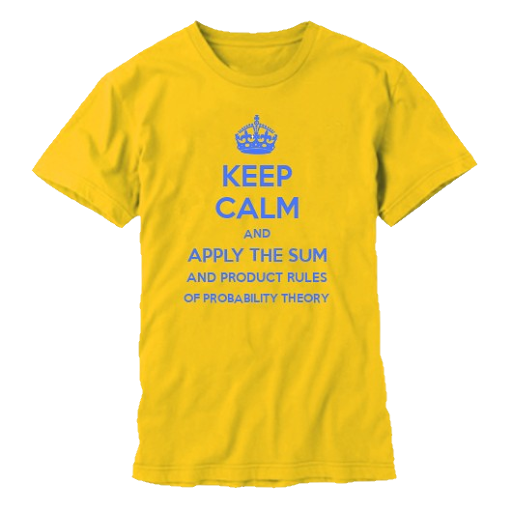

Speech waveforms
================

<!-- speaker_note:
The presentation is about how to represent speech waveforms as Gaussian processes

Speech waveforms are 1D pressure waveforms hitting our eardrums and being converted to electric signals

So how would "that" look like?
-->

<!-- pause -->

```bash +image
convert -density 300 assets/that.png -resize 80%x -background none  -channel RGB -negate png:-
```

Speech inversion [1]
===================

<!-- speaker_note:
Our brains are really good at "inverting speech"
What I mean is: we reconstruct the meaning of what someone said from a pressure waveform hitting our ears 

Note that there is a many-to-one phenomenon here:
Many utterances, or speech waveforms, all map to the same meaning
Our brains filter out room reverb and delay automatically

We can show this very crudely by throwing random math functions on speech waveforms and playing them out loud
-->

```bash +exec_replace
graph-easy --from=dot --as_boxart << 'EOF'
digraph {
    rankdir = LR;
    many -> one [label="to"];
}
EOF
```

<!-- pause -->

<!-- new_lines: 1 -->
<!-- column_layout: [1, 1] -->

<!-- column: 1 -->
<!-- alignment: center -->

> I know the human being and fish can coexist peacefully!

<!-- pause -->

<!-- column: 0 -->

```python
x = load("bush.wav")
```

```python +exec
/// from play import *
/// from numpy import exp, log, abs
play(x)

play(x**2)

play(exp(-x))
```

Speech inversion [2]
===================

<!-- speaker_note
So, many waveforms map to the same meaning

But there is another level of many to one to this

In a way, even MANY more

That is, given a waveform, there are infinitely many convolutions resulting in the identical waveform
-->

<!-- column_layout: [3, 1] -->

<!-- column: 0 -->

```bash +exec_replace
graph-easy --from=dot --as_boxart << 'EOF'
digraph {
    rankdir = LR;
    "∞ many" -> one [label="to"];
}
EOF
```

<!-- pause -->


<!-- pause -->

<!-- column: 1 -->

Problem:

```bash +exec_replace
graph-easy --from=dot --as_boxart << 'EOF'
digraph {
    "u * h = d"
}
EOF
```

given d, find (u, h)

# a blind inversion problem

## Ill-posed

- Needs regularization

What can we do?
===============

<!-- jump_to_middle -->

